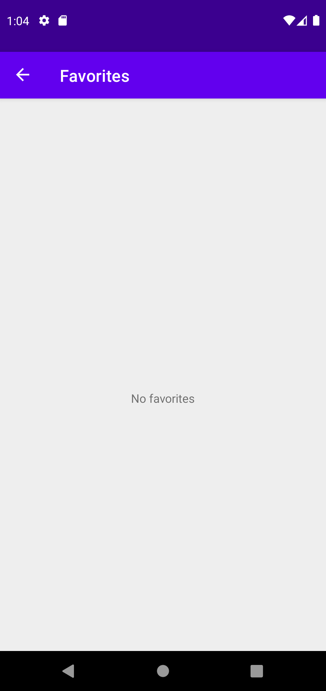

# GloboTour

> A practice project to help me level up on my native android development

## Android Concepts learned from building this application
- RecyclerView
- Navigation component
- Drawer layout with NavigationView
- CoordinatorLayout
- Constraint Layout
- Material AppBarLayout
- MaterialToolbar

## Application screenshots

|Example|Description|Preview|
|-------|-------|-----------|
| City list screen | Displays a list of cities to the user. |  |
| Navigation drawer| Allows the user to navigate between the two screens in the application. |  |
| Empty favorites screen | Displays a text view if the user has not added any cities to the favorite city list. |  |
| Favorite screen with data | Displays a list of cities that the user has selected as favorites |  |
